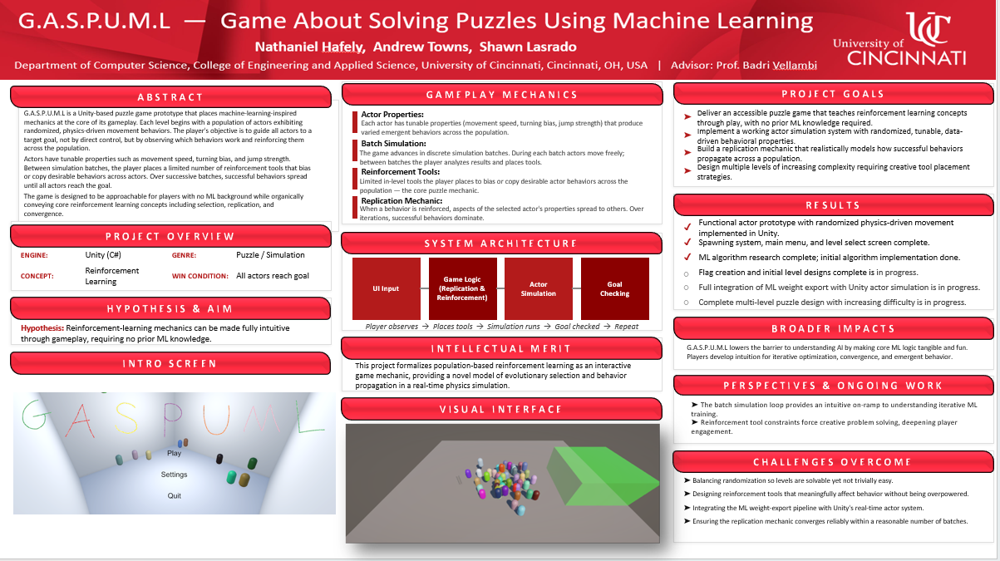

## CS5002 — Final Design Report

**Project**: G.A.S.P.U.M.L (Game About Solving Puzzles Using Machine Learning)  
**Repository**: [Repository README](../README.md)  
**Unity version**: `6000.2.7f2` (see [ProjectVersion.txt](../SeniorDesign/ProjectSettings/ProjectVersion.txt))

**Advisor**: Badri Vellambi  
**Team**:
- Andrew Towns
- Nathaniel Hafely
- Shawn Lasrado

---

## Table of contents
- [1. Project description](#1-project-description)
- [2. User interface specification](#2-user-interface-specification)
- [3. Test plan and results](#3-test-plan-and-results)
- [4. User manual](#4-user-manual)
- [5. Spring final presentation](#5-spring-final-presentation)
- [6. Final expo poster](#6-final-expo-poster)
- [7. Assessments](#7-assessments)
- [8. Summary of hours and justification](#8-summary-of-hours-and-justification)
- [9. Summary of expenses](#9-summary-of-expenses)
- [10. Appendix](#10-appendix)

---

## 1. Project description

### 400-character abstract
G.A.S.P.U.M.L is a Unity puzzle/simulation game where players don’t directly control characters. Instead, they place limited tools (flags) in a build phase and run a simulation to guide a group of actors into a win zone before time runs out. The project is playable without ML, with optional ML-Agents training/inference workflows.

### Overview (final project)
G.A.S.P.U.M.L formalizes “reinforcement-style” thinking into an approachable game loop:
- **Build**: the player places limited tools using a supplies budget
- **Simulate**: actors run; the player observes outcomes
- **Iterate**: adjust placements to reliably reach the goal

### Key implemented features
The project includes:
- **Complete loop**: Build → Simulate → Win/Lose overlays → Retry/Menu/Next
- **Tool/flag placement system** with:
  - limited uses per tool (per level)
  - **supplies economy** (spend on placement, refund on delete)
  - polished build toolbar layout + hover hints
- **Level progression**: unlocks persist via `PlayerPrefs` with a reset option
- **Camera + UX**: WASD pan, R reset view, Esc pause
- **Optional ML workflows**:
  - reproducible trainer venv setup + smoke run launchers
  - TensorBoard visibility
  - inference-mode toggle in the menu that imports a recent `.onnx` model

### How to run
- Start scene: [MainMenu.unity](../SeniorDesign/Assets/Scenes/MainMenu.unity)
- Demo runbook: [DEMO_CHECKLIST.md](../SeniorDesign/Docs/DEMO_CHECKLIST.md)

### Scenes included in builds (Unity Build Settings)
Scenes are included in this order:
- [MainMenu.unity](../SeniorDesign/Assets/Scenes/MainMenu.unity)
- [Level01.unity](../SeniorDesign/Assets/Scenes/Level01.unity)
- [Level02.unity](../SeniorDesign/Assets/Scenes/Level02.unity)
- [SampleScene.unity](../SeniorDesign/Assets/Scenes/SampleScene.unity)
- [Level03.unity](../SeniorDesign/Assets/Scenes/Level03.unity)

---

## 2. User interface specification

### UI structure (as built)
- **Main menu**
  - play / level select
  - settings (volume, reset unlocks, credits text)
- **In-level HUD**
  - phase indicator (Build/Simulate)
  - time remaining and end-state overlays
  - phase action button (Simulate / Back to build)
- **Build toolbar**
  - tool slots with cost and uses remaining
  - hover feedback (short → long name + bottom hint)

### UI artifacts (screenshots)
- Expo poster (includes UI screenshots): [poster.png](poster.png)

---

## 3. Test plan and results

### Test plan
- [TestPlan.md](TestPlan.md)

### Test execution summary (results)
Testing was executed continuously through implementation via playtests and the demo runbook. The following items were validated:
- **Menu → level load** works for intended scenes.
- **Build → Simulate** loop runs without critical console exceptions.
- **Win/Lose** states show correct overlays and allow Retry/Menu/Next.
- **Tool placement + economy** works (spend supplies on placement; delete refunds supplies).
- **Progression** persists via `PlayerPrefs`; reset works.
- **Optional ML smoke training** is documented and has been validated via trainer connection + TensorBoard.

**Evidence in repo**:
- [Playable_State_Roadmap.md](../SeniorDesign/Docs/Playable_State_Roadmap.md) (MVP checklist marked complete)
- [README_HANDOVER.md](../SeniorDesign/README_HANDOVER.md) (append-only log of changes and validations)
- [DEMO_CHECKLIST.md](../SeniorDesign/Docs/DEMO_CHECKLIST.md) (demo runbook)
- [Scene_Inspector_Checklist.md](../SeniorDesign/Docs/Scene_Inspector_Checklist.md) (scene wiring validation checklist)

---

## 4. User manual

User Guide & Manual (includes FAQ):
- [UserDocs.md](UserDocs.md)

---

## 5. Spring final presentation

Presentation slides:
- [SpringDesignPresentation.pptx](SpringDesignPresentation.pptx)

---

## 6. Final expo poster

Poster:
- [poster.png](poster.png)

Preview:

---

## 7. Assessments

### 7.1 Initial self-assessments (Fall)
Fall self-assessment essays:
- Andrew: [andrew_towns_capstone_assessment_essay.md](../FallAssignments/Assignment3/andrew_towns_capstone_assessment_essay.md)
- Shawn: [ShawnCapstoneAssessment.md](../FallAssignments/Assignment3/ShawnCapstoneAssessment.md)
- Nathan: [NathanielHafelySelf-AssessmentEssay.pdf](../FallAssignments/Assignment3/NathanielHafelySelf-AssessmentEssay.pdf)
- Folder (includes team contract): [FallAssignments/Assignment3/](../FallAssignments/Assignment3/)

### 7.2 Final self-assessments (Spring)
**Status**: Not currently in this repository.  
Spring self-assessment essays:
- Andrew: [Reflection_Towns.pdf](Assessments/Reflection_Towns.pdf)

---

## 8. Summary of hours and justification

**Status**: WIP.

### Required summary (fill in)
| Team member | Fall hours | Spring hours | Year total | Estimated $ (if required) |
|---|---:|---:|---:|---:|
| *(Name)* | *(TBD)* | *(TBD)* | *(TBD)* | *(TBD)* |
| *(Name)* | *(TBD)* | *(TBD)* | *(TBD)* | *(TBD)* |
| *(Name)* | *(TBD)* | *(TBD)* | *(TBD)* | *(TBD)* |

### Justification evidence (recommended links)
- [README_HANDOVER.md](../SeniorDesign/README_HANDOVER.md) (dated engineering log with validations)
- [Unity Change sets.pdf](Unity%20Change%20sets.pdf) (Unity version control main branch commits)
- *(add meeting notes folder/files here)* e.g. `../SeniorDesign/Docs/MeetingNotes/`

---

## 9. Summary of expenses

Expense Table:
| Item | Source | Cost | Notes |
|---|---|---:|---|
| Unity Editor | Free | $0 | Educational use |
| *(TBD)* | *(TBD)* | *(TBD)* | *(TBD)* |

---

## 10. Appendix

### Key project docs
- Demo runbook: [DEMO_CHECKLIST.md](../SeniorDesign/Docs/DEMO_CHECKLIST.md)
- Scene wiring checklist: [Scene_Inspector_Checklist.md](../SeniorDesign/Docs/Scene_Inspector_Checklist.md)
- Playable MVP checklist: [Playable_State_Roadmap.md](../SeniorDesign/Docs/Playable_State_Roadmap.md)
- Test plan: [TestPlan.md](TestPlan.md)
- User manual: [UserDocs.md](UserDocs.md)
- Engineering log / work evidence: [README_HANDOVER.md](../SeniorDesign/README_HANDOVER.md)
- Mac trainer setup: [README_MAC_SETUP.md](../SeniorDesign/README_MAC_SETUP.md)

### Technical references
- Unity packages: [manifest.json](../SeniorDesign/Packages/manifest.json) (includes `com.unity.ml-agents`)
- Trainer config: [actor_ppo.yaml](../SeniorDesign/Assets/ML-Agents/actor_ppo.yaml)
- ML environment setup scripts:
  - [Setup-MLAgentsVenv.ps1](../SeniorDesign/Setup-MLAgentsVenv.ps1) / [Setup-MLAgentsVenv.cmd](../SeniorDesign/Setup-MLAgentsVenv.cmd) / [Setup-MLAgentsVenv.sh](../SeniorDesign/Setup-MLAgentsVenv.sh)
  - [Start-MLSmoke.ps1](../SeniorDesign/Start-MLSmoke.ps1) / [Start-MLSmoke.cmd](../SeniorDesign/Start-MLSmoke.cmd) / [Start-MLSmoke.sh](../SeniorDesign/Start-MLSmoke.sh)
  - [Stop-MLSmoke.ps1](../SeniorDesign/Stop-MLSmoke.ps1) / [Stop-MLSmoke.cmd](../SeniorDesign/Stop-MLSmoke.cmd) / [Stop-MLSmoke.sh](../SeniorDesign/Stop-MLSmoke.sh)